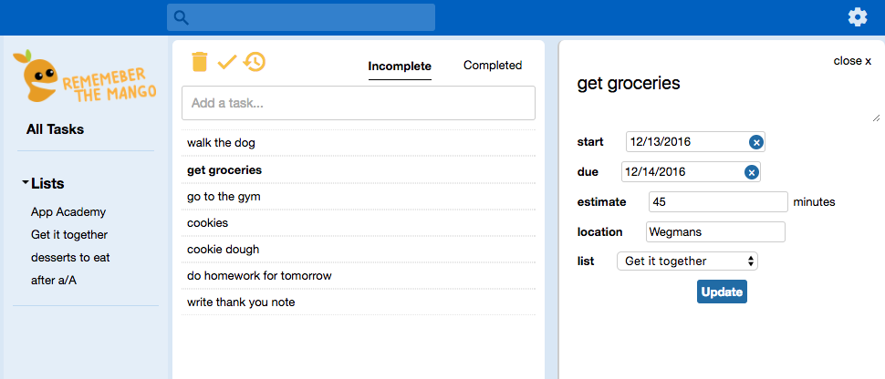

# Remember The Mango

[Remember The Mango live site][heroku]
[heroku]: http://rememberthemango.herokuapp.com/?#/welcome

Remember the Mango is a single-page, full-stack web application inspired by Remember the Milk. It utilizes Ruby on Rails on the backend, a PostgreSQL database, and React.js with a Redux architectural framework on the frontend.

## Features

Remember the Mango allows its users to:
* Create, edit, and delete tasks
* Create, edit, and delete tasks in to-do lists
* Edit a task to update its title, start and due dates, time estimate, list association, location, and whether or not it is complete.
* View and change the location of their task on a Google map
* Label and sort tasks according to whether they are complete or not.
* View a summary of a list or all tasks detailing the total time, amount of tasks, and whether they are overdue or completed.
* Search for tasks

## Intuitive URLs

Due to being a single page web application, the user remains on the root url for their entire experience. Remember the Milk gives descriptive URLs to each location in the app which enables navigation without reloading the page.

## Future Features

I plan to add the following features to Remember the Mango:

* Optimization on the backend to reduce queries to the database
* Users can sort tasks based on their date, estimated time, or their priority
* Users can add tags to tasks and view tasks based on those tags
* Users can send and receive tasks from other users
